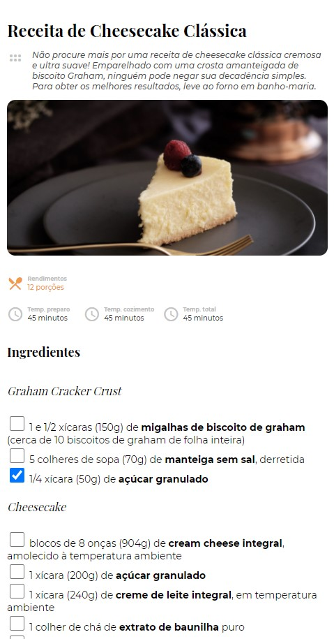

<!-- Please update value in the {}  -->

<h1 align="center">Recipe Paga</h1>

   Solution for a challenge from  <a href="http://devchallenges.io" target="_blank">Devchallenges.io</a>.

  <h3>
    <a href="https://williamhmw.github.io/recipe-page/">
      Demo
    </a>
     | 
    <a href="https://github.com/williamhmw/recipe-page">
      Solution
    </a>
     | 
    <a href="https://devchallenges.io/challenges/OEKdUZ6xs0h99C38XVht">
      Challenge
    </a>
  </h3>

<!-- TABLE OF CONTENTS -->

## Table of Contents

- [Introdução](#introdução)
  - [Feito com](#feito-com)
- [Recursos](#recursos)
- [Contato](#contact)

<!-- OVERVIEW -->

## Introdução

Nesse projeto utilzei HTML para fazer a marcação da página e o CSS para estilizar todo o conteúdo.

Na construção do projeto foi utilizado alguns recursos de flexbox e grid em CSS.

Além do desafio de criar a página, iniciei o projeto utilizado a linguagem pré-compilada SASS, o resultado foi o ganho de perfomance para escrever o código em poucas linhas se comparado com o arquivo CSS.

Conforme os projetos vão evoluindo o SASS vai fazer cada vez mais diferença no processo

Para acessar a demo basta cliccar no link acima em "Demo".

### Feito com

<!-- This section should list any major frameworks that you built your project using. Here are a few examples.-->

- [HTML](https://developer.mozilla.org/en-US/docs/Web/HTML)
- [CSS](https://developer.mozilla.org/en-US/docs/Web/CSS)
- [JS](https://developer.mozilla.org/en-US/docs/Web/JavaScript)
- [SASS/SCSS](https://sass-lang.com/)

## Recursos

<!-- List the features of your application or follow the template. Don't share the figma file here :) -->

Este site foi criado como um envio para um desafio [DevChallenges](https://devchallenges.io/challenges) . O [desafio](https://devchallenges.io/challenges/OEKdUZ6xs0h99C38XVht) era construir um site para completar as histórias de usuário fornecidas.

## Contato

- GitHub [@williamhmw]https://github.com/williamhmw)
- Linkedin [@william-honorio-m](https://www.linkedin.com/in/william-honorio-m/)